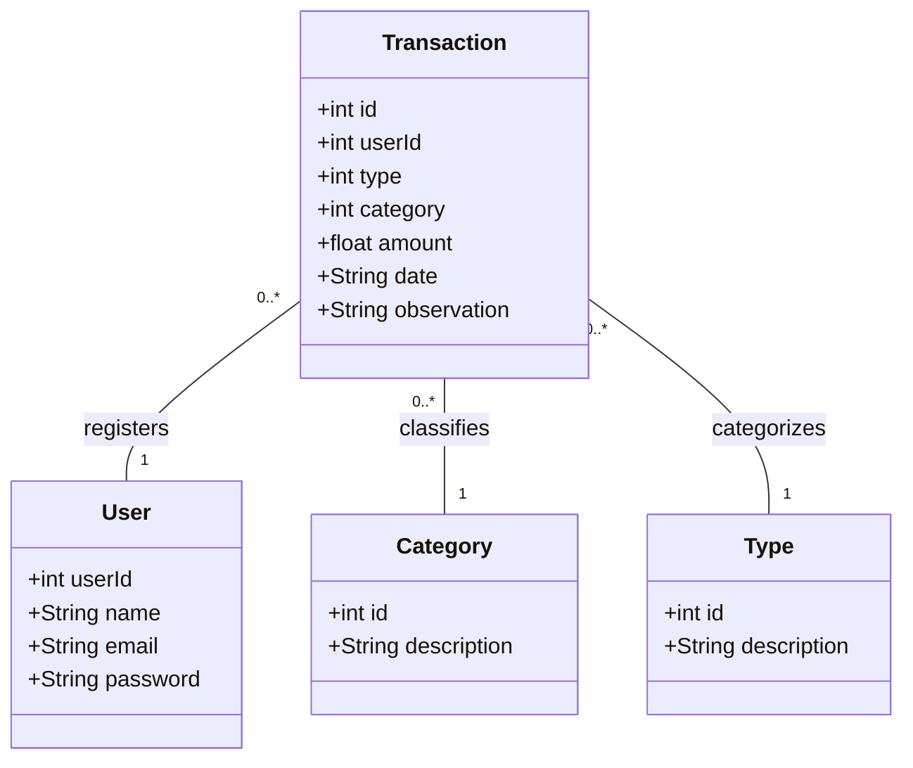

# Publicando Sua API REST na Nuvem Usando Spring Boot 3, Java 17 e Railway - DIO

## 💻 Sobre o projeto

Usei como base para criar a API REST em Java [uma API criada em JavaScript](https://github.com/GessycaBorges/api-dindin), durante um curso que realizei.

---
## 📊 Diagrama de Classes

## ✅ Endpoints

1. Criar Usuário
- URL: /users
- Método: POST
- Descrição: Cria um novo usuário.

2. Obter Usuário por ID
- URL: /users/{id}
- Método: GET
- Descrição: Retorna um usuário específico pelo ID.

3. Listar Categorias
- URL: /categories
- Método: GET
- Descrição: Retorna todas as categorias disponíveis.

4. Criar Transação
- URL: /transactions
- Método: POST
- Descrição: Cria uma nova transação.

5. Obter Transação por ID
- URL: /transactions/{id}
- Método: GET
- Descrição: Retorna uma transação específica pelo ID.

6. Deletar Transação
- URL: /transactions/{id}
- Método: DELETE
- Descrição: Remove uma transação específica pelo ID.

7. Listar Transações por Tipo
- URL: /transactions/type/{type}
- Método: GET
- Descrição: Retorna todas as transações de um determinado tipo.

8. Listar Transações por ID de Usuário
- URL: /transactions/user/{userId}
- Método: GET
- Descrição: Retorna todas as transações de um determinado usuário.
