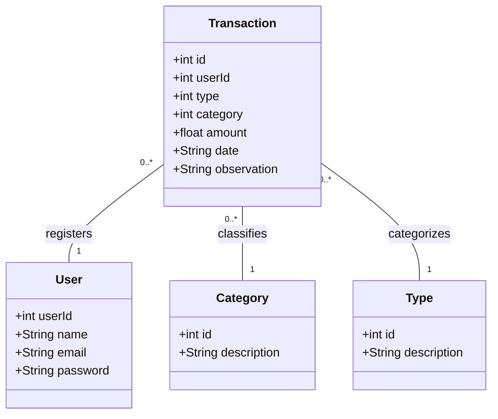

# Publicando Sua API REST na Nuvem Usando Spring Boot 3, Java 17 e Railway - DIO

## 💻 Sobre o projeto

Usei como base para criar a API REST em Java o [Dindin](https://github.com/GessycaBorges/api-dindin), uma API criada em JavaScript durante um curso que realizei.

---
## ⚙️ Diagrama de Classes

